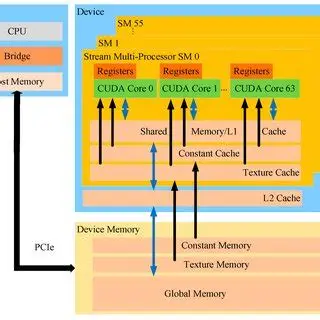

Here’s a well-structured and markdown-friendly version of your content, ready for a GitHub README or documentation file:

---

# 🚀 CUDA Matrix Multiplication — Memory Optimization Guide

This repository explores various **CUDA memory types** to optimize **matrix multiplication**, starting from a baseline global memory version and improving step-by-step.

---

## 🔍 Current Implementation (Global Memory Only)

* All matrices (`A`, `B`, and `C`) are allocated in **global memory**
* Each thread accesses global memory multiple times in the inner loop
* No memory optimizations are used

This acts as a **baseline** to measure performance gains in later versions.

---

## 💡 CUDA Memory Types: Explained

### 1. **Global Memory** (Baseline)

* **Used In**: Current version
* **Latency**: \~400–800 cycles
* **Capacity**: Large (device DRAM)
* **Access**: Direct per-thread reads/writes
* **Usage Tip**: Avoid uncoalesced access

---

### 2. **Shared Memory**

* **Type**: On-chip, per-SM
* **Latency**: \~100 cycles
* **Size**: 48KB (per SM, configurable)
* **Use Case**: Tile-based matrix multiplication
* **Benefits**:

  * 5–10x speedup over global memory
  * Drastically reduces redundant reads
* **Implementation Strategy**:

  * Divide matrices into tiles
  * Load tiles into `__shared__` memory
  * Synchronize and compute locally

---

### 3. **Constant Memory**

* **Type**: Read-only, cached
* **Size**: 64KB max
* **Latency**: \~100 cycles (cache hit)
* **Use Case**: Small matrices/parameters accessed by all threads
* **Benefits**:

  * Broadcast to all threads in a warp
  * Less pressure on global memory

---

### 4. **Texture Memory** *(Legacy)*

* **Type**: Cached, optimized for 2D spatial locality
* **Use Case**: Image/matrix access with 2D locality
* **Benefits**:

  * Hardware interpolation
  * Spatial caching for nearby values
* **Note**: Deprecated in favor of surface memory and modern memory models

---

### 5. **Pinned (Page-Locked) Host Memory**

* **Type**: Host-side memory registered for GPU access
* **Latency**: \~2x faster host↔device transfer via DMA
* **Use Case**: Faster data transfer between CPU & GPU
* **Trade-off**:

  * Uses physical RAM directly
  * Reduces system memory available

---

### 6. **Unified Memory**

* **Type**: Single memory space accessible from both CPU and GPU
* **Requires**: CUDA 6.0+
* **Use Case**: Simplified memory management
* **Benefits**:

  * Automatically migrates data
  * Easier to write hybrid CPU-GPU programs
  * Good performance with proper hints

---

## 📊 Performance Comparison

| Memory Type     | Transfer Speed | Compute Speed  | Use Case                           |
| --------------- | -------------- | -------------- | ---------------------------------- |
| Global Memory   | Normal         | Slowest        | Default access, no optimization    |
| Shared Memory   | N/A            | Fastest        | Tile-based matrix ops, reuse-heavy |
| Constant Memory | N/A            | Fast for read  | Reused config/small data           |
| Pinned Memory   | Fastest        | Same as global | Faster host↔device transfers       |
| Unified Memory  | Auto-managed   | Good           | Simple coding, large data sets     |

---

## 🔄 CUDA Memory Hierarchy (Fast → Slow)

1. **Registers** (per-thread, fastest)
2. **Shared Memory** (per-block, on-chip)
3. **Constant Cache** (broadcast-optimized)
4. **Texture Cache** (read-optimized)
5. **L1/L2 Cache**
6. **Global Memory** (device DRAM, high latency)

---

## 🛠️ To-Do: Implement and Benchmark

* [x] Global memory version ✅
* [ ] Shared memory (tiled) optimization ⏳
* [ ] Constant memory read-only version ⏳
* [ ] Pinned host memory for fast I/O ⏳
* [ ] Unified memory version ⏳
* [ ] Performance benchmarking (nsight compute) ⏳

---

## 📎 References

* [CUDA C Programming Guide (NVIDIA)](https://docs.nvidia.com/cuda/cuda-c-programming-guide/)
* [CUDA Memory Optimization](https://developer.nvidia.com/blog/efficient-matrix-transpose-cuda-cc/)
* Nsight Compute / Nsight Systems for performance profiling

---
